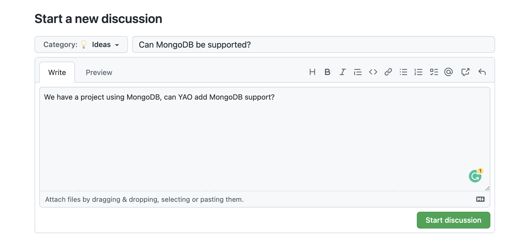

# 参与贡献

> 开源，已然成为了一个"时代潮流”，一个项目如果不开源，你都不好意思跟人家打招呼。

为什么开源？ 开源了你还怎么挣钱？ 你们是不是就为了“蹭热点”？

YAO 开源之后，回答这些问题，成了我们的日常工作。

## 开源的意义

在 YAO 的介绍中曾提到，创作 YAO 的初衷是想打造一款工具，这个工具可以帮助开发者，从重复无趣的劳动中解放出来，可以告别
996，有更多精力思考，去创作更多有趣的作品。

正因如此，YAO 没有 KPI/OKR，Stars 数量 对 YAO 也没有意义。我们唯一的希望是 YAO 可以给更多人带来价值，有更多人使用它。

**开源，也并非是营销工具，开源的意义在于协作、交流和分享。**

我们从优秀的开源项目中学习技术，捕获灵感；在与大牛的交流中，获得启发，提升自我。这些点滴积累，最终都变成代码应用于 YAO，让它变得更好。

YAO 也通过开源的方式，与大家分享我们的思考、我们的实践成果，这些实践经验或代码也可以应用在你的项目中，让你的项目变得更好。

## 开源的协作方式

Linux，只要人类能够到达的地方，几乎都有它的身影。

Linux 的诞生和发展，也是人类历史上最成功的协作案例。能够让数万开发者有序工作，创作数千万行代码，这就是开源协作的力量。

随着网络环境、VR/AR 等技术的成熟，在一些特定领域，人与人的协作方式也悄然发生着变革，我们相信远程办公也将成为主流。

从新款冠流行开始，我们尝试纯远程办公的方式工作。在各种协同工具的加持下，我们惊讶的发现，远程办公并没有降低工作效率，反而有不少提升。

这些实践经验也引发我们思考，有没有一种可能，一群陌生人通过开源协作的方式，共同创作有价值的项目？每个人都可以做自己喜欢的事情，且参与者可以通过项目盈利，获得收益？

公司的发明，也可以看做是人类协作方式的方式革命，它释放了巨大生产力。那么未来，会不会出现超越 “公司” 的组织形式，可以更高效的创造价值，获得收益，且可以相对公平的分享这些收益？

当然这些现在看起来还过于理想化，还需逐步实践落地，我们也会持续探索，寻找最佳落地路径。

## 参与贡献

如果 YAO 可以给您带来价值并认同我们的开源理念，欢迎您与我们一起共建共用。

### 参与方式

1. 提供需求或建议
2. 提交改进

### 提供需求和建议

您可以在 [discussions](https://github.com/YaoApp/yao/discussions) 中发表您的需求或改进建议。

将帖子类型设定为 `Ideas` , 标题应可以有效表达需求或建议核心内容。

示例:

### 提交改进

...

## 贡献者列表
