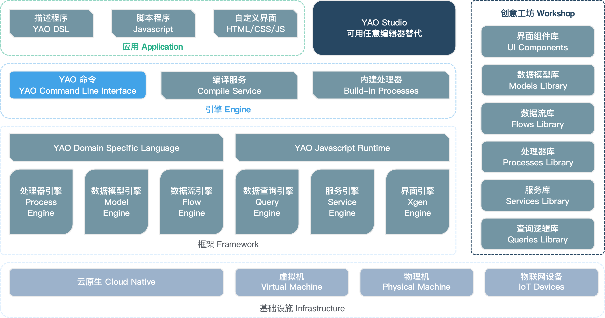

# YAO 架构解析


YAO 是一款开源应用引擎，使用 Golang 编写，下载即用。适合用于开发业务系统、网站/APP API 接口、管理后台、自建低代码平台等。

YAO 根据业务特征，定义了一套 YAO DSL，用来描述数据结构、数据流、API 接口、并发任务、计划任务、Socket 服务等功能模块，这些功能模块被定义为 Widget。

在引擎启动时，根据 Widget 逻辑，将其解析为一组 API 接口和一组处理器。 在应用开发中，编写 Widget DSL 描述差异，即可实现对应功能模块，从而提升编码效率。

YAO DSL 和 YAO Widget 支持根据自身业务特征定义扩展，这让基于 YAO 构建符合自身业务特征的低代码平台变得更加容易。

## YAO VS 低代码

与大部分低代码平台相比，YAO 具有更好的通用性、应用独立发布（可申请软著)、非一次性代码，可持续迭代升级、不限于”托拉拽“, 有多种编写方式等优势。



### 应用独立发布


与大部分代码开发平台不同，YAO 的定位是给开发者提供快速构建应用的工具。

使用 YAO 开发的应用代码独立发布，可申请软著，无缝对接云原生工具链，与使用 `PHP`, `NodeJS` 等脚本语言开发的应用无差别。

### 非一次性代码

不同于代码生成器, YAO DSL 开发者可阅读、可以编写, 开发者可精确掌控业务逻辑, 应用可持续迭代升级。

应用引擎全量开源, 技术团队可完全掌控全部代码。

Table DSL 示例:

```jsonc
{
  "name": "::Bind Model",
  "action": {
    "bind": {
      "model": "pet",
      "option": { "form": "pet" } //
    },

    // 自定义关联处理器
    "search": {
      "guard": "-", // 鉴权方式
      "process": "scripts.pet.Search", // 调用处理器
      "default": [null, 1, 5] // 默认参数表
    }
  }
}
```

### 可替代脚本语言

YAO 内建 JavaScript Runtime, 可以使用脚本实现 95% 以上常见业务逻辑。

这一特性使 YAO 具备脚本语言的基础能力，在一些场景下可以代替脚本语言使用。

### 多种编写方式

YAO 应用有多种编写方式，且这些编程方式可以随意切换。

1. 支持手工编写， 开发者可以使用任意编程工具编写调试。
2. 支持程序生成， 根据上下文逻辑，自动生成 DSL 或脚本代码，甚至可以接入 AI 让人工智能编程序。
3. 支持可视化编程工具制作，使用 Studio 通过托拉拽图形化编程。

通过这种编码方式，可以有效提升生产力, 降低复制粘贴错误率，同时也让自动化编程成为可能。

<!-- 用程序生成的示例: https://github.com/YaoApp/yao-admin -->

Yao Studio Preview:


## 核心代码

### Yao App Engine

应用引擎命令行工具 & 特定场景处理器 [Yao App Engine](https://github.com/yaoapp/yao)

### Xgen 界面引擎

界面引擎 [Xgen](https://github.com/YaoApp/xgen-next)

### Gou Framework

引擎核心逻辑 & 通用处理器 [Gou Framework](https://github.com/yaoapp/gou)

### Xun Database

数据库 ORM [Xun Database](https://github.com/yaoapp/xun)

### Kun

常用数据结构 & 工具包 [Kun](https://github.com/yaoapp/kun)

[查看源码编译文档](../专家/%E6%BA%90%E7%A0%81%E7%BC%96%E8%AF%91.mdx)

## 添加处理器

对于一些特定场景，需要在引擎中添加新的处理器，使用 `gou.RegisterProcessHandler` 方法，将一个 Golang 函数注册为处理器。

建议设置特定的命名空间，防止冲突，这样做可以随时与 YAO 最新的代码合并。

添加一个处理器文件

```bash
mkdir -p /code/root/yao/myprocesses
touch /code/root/yao/myprocesses/hello.go
touch /code/root/yao/myprocesses/hello_test.go
```

### 处理器逻辑

`/code/root/yao/myprocesses/hello.go`

```go
package myprocesses

import(
    "github.com/yaoapp/gou"
)

func init() {
	gou.RegisterProcessHandler("mycom.myprocesses.hello", processHello) // 注册处理器
}

// processHello 处理逻辑
func processHello(process *gou.Process) interface{} {
	args := process.Args
	return map[string]interface{}{"args": process.Args}
}
```

在主程序中引用

编辑 `/code/root/yao/main.go`

```go

package main

import (
	"github.com/yaoapp/yao/cmd"

	_ "github.com/yaoapp/gou/encoding"
	_ "github.com/yaoapp/yao/crypto"
	_ "github.com/yaoapp/yao/helper"
	_ "github.com/yaoapp/yao/network"
	_ "github.com/yaoapp/yao/system"
	_ "github.com/yaoapp/yao/user"
	_ "github.com/yaoapp/yao/xfs"
    _ "github.com/yaoapp/yao/myprocesses"
)

// 主程序
func main() {
	cmd.Execute()
}

```

### 单元测试

`/code/root/yao/myprocesses/hello_test.go`

```go
package myprocesses

import (
	"testing"
	"github.com/stretchr/testify/assert"
	"github.com/yaoapp/gou"
)

func TestProcessHello(t *testing.T) {
	args := []interface{}{"hello world", "foo", "bar", 0.618}
	res, err := gou.NewProcess("mycom.myprocesses.hello", args...).Exec()
	if err != nil {
		t.Fatal(err)
	}
	assert.Equal(t, []interface{}{"hello world", "foo", "bar", 0.618}, res.(map[string]interface{})["args"])
}

```

运行测试

```bash
cd /code/root/yao/myprocesses
go test -run TestProcessHello
```

### 在应用中调用示例

#### 在数据流中使用

添加数据流文件

```bash
mkdir -p /code/root/yao/tests/flows/mycom
touch /code/root/yao/tests/flows/mycom/hello.flow.json
```

编写逻辑 `/code/root/yao/tests/flows/mycom/hello.flow.json`

```json
{
  "label": "Hello",
  "version": "1.0.0",
  "description": "Hello",
  "nodes": [
    {
      "name": "hello",
      "process": "mycom.myprocesses.hello",
      "args": ["hello world", "foo", "bar", 0.618]
    }
  ],
  "output": "{{$res.args}}"
}
```

运行测试

```bash
cd /code/root/yao/
go run . run flows.mycom.hello
```

#### 在 JavaScript 脚本中使用

添加脚本文件

```bash
mkdir -p /code/root/yao/tests/scripts/mycom
touch /code/root/yao/tests/scripts/mycom/hello.js
```

编写脚本 `/code/root/yao/tests/scripts/mycom/hello.js`

```javascript
function Hi() {
  return Process("mycom.myprocesses.hello", "hello world", "foo", "bar", 0.618);
}
```

运行测试

```bash
cd /code/root/yao/
go run . run scripts.mycom.hello.Hi
```

## 相关内容

接下来，建议学习以下章节:

<Div style={{ display: "flex", justifyContent: "space-between" }}>
  <Link type="prev" title="安装调试" link="介绍/安装调试"></Link>
  <Link type="next" title="为什么选择Yao" link="介绍/为什么选择Yao"></Link>
</Div>
