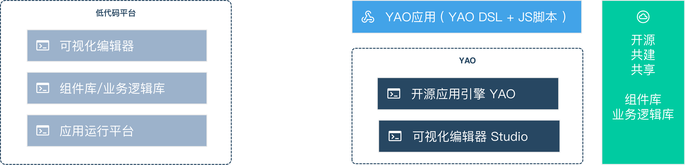
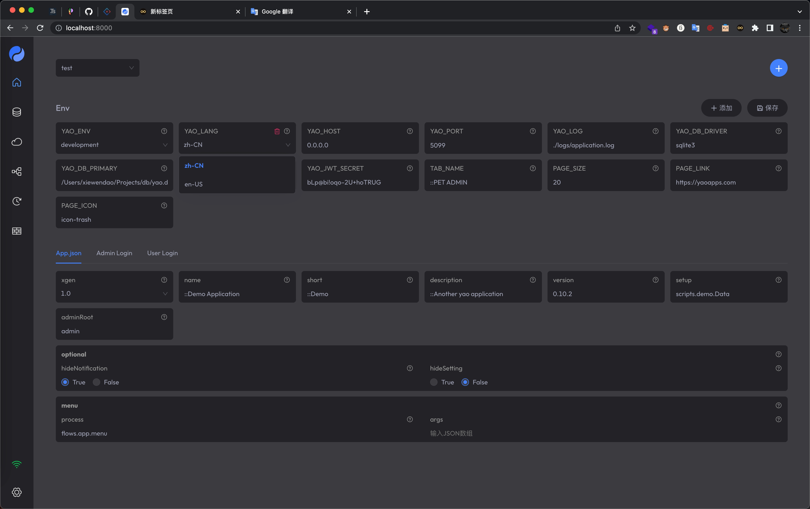

# 为什么选择 Yao

<blockquote>
  <p>
    宇宙的开端仿佛是深吸一口气，然后屏住了呼吸。没人知道为什么，然而不管原因如何，我很高兴宇宙以这样的形式诞生，因为我的存在也要归因于此。我所有的欲望和沉思正是我们的宇宙缓缓呼出的气流。在这漫长的呼气结束之前，我的思维将一直存在。
  </p>
  <p>——特德·姜 《软件体的生命周期》</p>
</blockquote>

## 开端

2022 年 1 月 29 日 00:40 分，周六，还有两天就是 2022 年春节，窗外下着小雨，又是一个寒冬。上一次这么冷的时候还是 2016 年。

已经不知道这是第几次重新开始写了，这一段真的很难写，写的太过，有王婆卖瓜自卖自夸的嫌疑，写的太官方，又无法让人读下去，思来想去，就权当是一次面对面的分享，虽然我是 Yao 核心开发团队的一员，但我会尽量以客观的方式，来表达 Yao 与其他解决方案的差异还有优劣，希望你看完之后能有有所收获。

为什么选择 Yao，这个问题很务实，坦白来说，我们一直以来都有一个疑虑，就是 Yao 的定位问题，你说它是框架，它又能支持低代码搭建，你说它是应用，但是你能说写 JSON 不是写代码，唯一的差别就是，写 JSON 的效率比写代码高 10 倍，是的，你没听错，也不是我在吹牛，就是十倍，可能还不止。

在 Yao 成型之初，我们在一个月里交付了不下于 3 个项目，按照以往的经验，这些项目如果使用代码开发，保守估计得大半年，还不包含测试的时间。后来因为各种需求而支持了数据可视化、数据大屏、数据清洗等功能，累计超过 36 个页面组件，表格、表单、图表、看板、大屏 5 种类型页，项目越做越快，我们开始意识到，Yao，不止是框架，如果必须要给一个定义的话，它会是：

<blockquote>Go语言实现的应用引擎。</blockquote>

没有过多的修饰，正如我们倡导的精神——实用即美。

我们希望，通过 Yao，开发者能够重新审视软件开发，能够从一些繁重的，重复的，无趣的，可代替性高的工作中解脱出来，去做更独特更有价值的事情，即便是玩儿，也比一群世界上顶尖学府毕业的高材生比拼 996，谁更能卷，要好。

1913 年，福特创立了汽车装配流水线，为工业化装上了引擎，而这之前，人类一直在工业化时代的门口徘徊，这之后，人类正式迈入工业化时代，流水线，也奠定了百年福特的历史地位。

我将之称为**“人的机械化”**。

现在是 2022 年，互联网时代已进入尾声，互联网时代带来的是**“人的数据化”**，人的数据化解决的是人的个性化需求的问题，但人的需求是跟上了，生产如果不发生变革，就会导致生产无法满足需求，或者会出现当今世界较为普遍的情况——生产过剩，而在一些消费领域，又极度缺少产能。

为了解决这个问题，聪明的科学家和智库学者们又提出了一个新的方案——“万物互联”，不仅仅是“工业互联网”，而是把我们能够调控的事物全部通过数据连接起来，我称之为**“环境的数据化”**。

但与此同时，我们就会面临一个新的问题，即使用中心化的服务器去处理世界上这么多人的个性化需求都用了这么多年才达到，甚至都不能说做的很好，那面对社会环境中如此之多的设备，我们想要靠开发者去 996，去搞人海战术，基本不可能。

是时候开始进行软件开发的变革了，也许，我是说也许，走到最后的不一定的 Yao，但我们希望通过我们的努力，去让万物互联的时代，早点到来。

## 对比

尽管严格意义上讲，Yao 与市面上的大部分技术栈都不是一个物种，但新生事物难免会面临一些质疑，所以有必要进行一些对比，以此来告知开发者，Yao 能做什么，不擅长做什么。

### 低代码平台

与大部分低代码平台相比，YAO 具有更好的通用性、应用独立发布（可申请软著)、非一次性代码，可持续迭代升级、不限于”托拉拽“, 有多种编写方式等优势。

### 应用独立发布



与大部分代码开发平台不同，YAO 的定位是给开发者提供快速构建应用的工具。

使用 YAO 开发的应用代码独立发布，可申请软著，无缝对接云原生工具链，与使用 `PHP`, `NodeJS` 等脚本语言开发的应用无差别。

### 非一次性代码

不同于代码生成器, YAO DSL 开发者可阅读、可以编写, 开发者可精确掌控业务逻辑, 应用可持续迭代升级。

应用引擎全量开源, 技术团队可完全掌控全部代码。

Table DSL 示例:

```jsonc
{
  "name": "::Bind Model",
  "action": {
    "bind": {
      "model": "pet",
      "option": { "form": "pet" } //
    },

    // 自定义关联处理器
    "search": {
      "guard": "-", // 鉴权方式
      "process": "scripts.pet.Search", // 调用处理器
      "default": [null, 1, 5] // 默认参数表
    }
  }
}
```

### 可替代脚本语言

YAO 内建 JavaScript Runtime, 可以使用脚本实现 95% 以上常见业务逻辑。

这一特性使 YAO 具备脚本语言的基础能力，在一些场景下可以代替脚本语言使用。

### 多种编写方式

YAO 应用有多种编写方式，且这些编程方式可以随意切换。

1. 支持手工编写， 开发者可以使用任意编程工具编写调试。
2. 支持程序生成， 根据上下文逻辑，自动生成 DSL 或脚本代码，甚至可以接入 AI 让人工智能编程序。
3. 支持可视化编程工具制作，使用 Studio 通过托拉拽图形化编程。

<!-- 用程序生成的示例: https://github.com/YaoApp/yao-admin -->

Yao Studio Preivew:



### Laravel

我们从 Laravel 中获取了很多灵感，Yao 和 Laravel 有很多相识之处：

- 优雅的 MVC 架构

- 通俗易懂的 ORM

就传统后端框架来讲，Laravel 确实可以说是 PHP 领域的王者，但面对一个日渐消逝的 PHP 生态，Laravel 优雅到极致也无法改变 PHP 日落西山的命运。而 Yao 相比于 Laravel，如果把 Yao 只当后端框架来使用，Yao 也拥有无可比拟的优势：

- 基于 Golang，性能上吊打 PHP 相关框架

- Yao CLI，0 依赖开发项目

- Serverless，且支持云原生部署

- 基于 Flow 的编程模式，入门门槛低（参考 Unreal Engine 节点编辑器）

- 支持使用 Javascript 来处理数据

- 插件，支持 GRPC 协议的第三方语言开发的插件

- 海量处理器，适配 80%业务场景

- 更多特性有待你的探索...

### 轻流、Mendix、Power Platform

低代码现在有两个主流的方向:

- 代码的抽象，像各类 aPaas 平台，他们主要负责整合一些代码块，让人更加容易使用。

- 抽象的代码，指具备完整的逻辑表述能力，通过一系列高层次的代码工具链实现低代码目标。

我们做的就是“抽象的代码”。做“代码的抽象”不难，可能更多的精力都会花费在搭建平台，营销推广，还有销售上。但做“抽象的代码”就很具有挑战性了，因为严格意义上讲，“抽象的代码”已经脱离了“元编程”的范畴，进入到了编程语言的领域内，这就要求我们有极强的实现能力和自我约束能力，从编程语言的层面来思考一些问题，而不仅仅局限在工具层面。

这是一条不一样的路，我们希望我们迈出这一步，它不仅仅让我们被大家看见，更重要的在于，竖起一面旗帜，我们要打造技术驱动而不是平台驱动的产品，这样，才有核心竞争力。

Yao 和上述方案相比，还是有很多优点的：

- 开源，接受所有人的代码安全审计

- 真正的去中心化，以引擎的模式存在，本质上是一个命令行工具

- 部署方便，打包出来的产物可以在目标平台直接运行

另外，Yao 适合**有一定编程经验的开发者学习和使用**，对于小白用户，你需要首先数据库模型、接口、数据流一些开发需要的基础知识。根据我们团队内部的经验，一个开发经验 1 年左右的前端开发者，只需要 1 周的时间，就可以熟练使用 Yao 并搭建商业项目，一天能够完成 6 个左右业务模块，这个相比于传统软件开发，在效率上差了可能十倍不止。

Yao 也有不擅长的事情，对于一些 C 端定制型的 UI，你能用到的只有 Yao 的后端能力，这是 Yao 的局限性，我们也不能希望说 Yao 能满足所有场景，那不现实，把我们擅长的做到最好，精益求精，所以我们一直以来都一个清晰的目标——让万物互联的时代，早点到来。

推荐阅读 [YAO 适合场景](YAO适合场景)

## 未来

我们会在未来的日子里推出可视化操作的服务，将对 JSON 的操作全部可视化，这样能进一步降低开发门槛，让小白用户看着开发文档也能轻松开发企业级后台应用。我们也在考虑对一些核心模块进行重构，以此来让使用 JSON 的开发者和使用可视化界面的开发者拥有同等的便利。

## 感谢

另外，可能你也注意到，我们官网的风格和 Nextjs 有些类似，没错，我们确实从 Nextjs 那获得了很多启发，关于设计，关于开源，respect for Vercel！与此同时，也感谢以下开源项目（排序不分先后），没有这些开源项目，Yao 就不会出现：

- [Laravel](https://github.com/laravel/laravel)

- [Gin](https://github.com/gin-gonic/gin)

- [GRPC](https://www.grpc.io/)

- [NodeRed](https://nodered.org/)

- [React](https://github.com/facebook/react)

- [Umi](https://github.com/umijs/umi)

- [Ant Design](https://github.com/ant-design/ant-design)

- [Echarts](https://github.com/apache/echarts)

- [Nextjs](https://github.com/vercel/next.js)

- [ReactFlow](https://github.com/wbkd/react-flow)

- [MonacoEditor](https://github.com/microsoft/monaco-editor)

- [v8Go](https://github.com/rogchap/v8go)

- [sqlx](https://github.com/jmoiron/sqlx)

<Div style={{ display: "flex", justifyContent: "space-between" }}>
  <Link type="prev" title="YAO架构解析" link="介绍/YAO架构解析"></Link>
  <Link type="next" title="YAO适合场景" link="介绍/YAO适合场景"></Link>
</Div>
