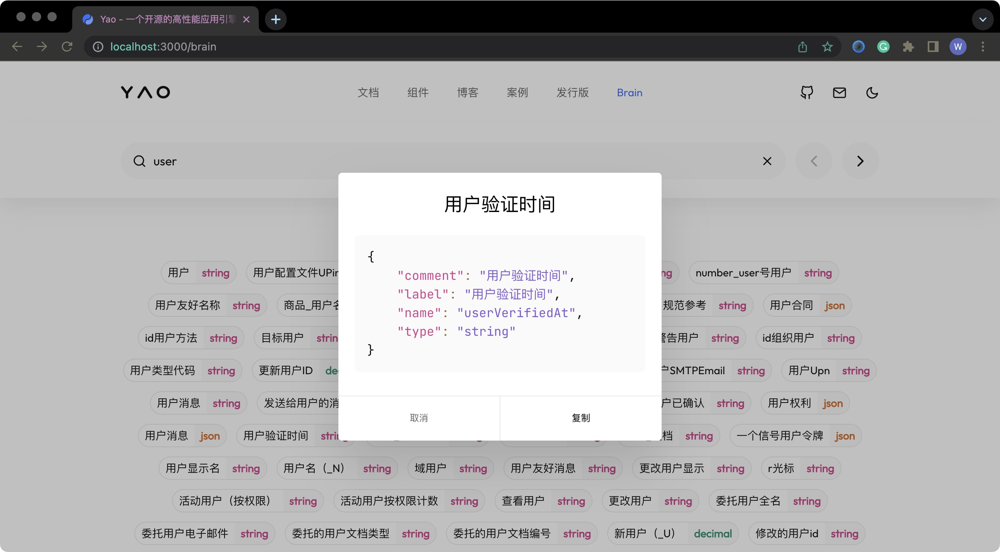

# Yao v0.10.2 正式发布 你好无代码

> 无代码开发平台是可以让程序设计者及一般用户不用传统程序设计语言即可以开发应用程序的开发平台，使用的是图形用户界面（GUI）以及配置。(维基百科)

在一些特定场景中, 使用图形界面开发, 确实可以有效的提升程序开发的生产力, 也有很多优秀的实践案例。

然而, 这种开发效率提升, 是以牺牲通用性、无法精确掌控逻辑、应用必须与平台深度绑定、存在数据泄露风险、甚至无法掌控业务数据为代价。

不仅如此, 应对一些常见场景, 通过 ”托拉拽“ 编程更低效。 比如:

1. 一张数据表有 100 个字段, 使用托拉拽配置一个数据管理表格。
2. 一个业务系统有 200 张数据表, 使用图形界面配置出管理后台。
3. 在没有数据分析平台的前提下, 一个业务指标统计涉及到多张表查询和复杂的数据处理。
4. ...

Yao 没有采用大力出奇迹的办法, **而是换了一个新思路, 去解决这些问题。**

Yao v0.10.2 重构了界面引擎、新增 Studio CLI、DSL 编写处理器, 发布了 Yao Brain 平台 (DEMO 版)。

基于这些新特性, 开发者可以**轻松**根据上下文逻辑, **用程序编程序**, 开发出 **真无代码** 产品。

**Yao Admin**

为了演示效果, 我们用 Yao 开发了一个通用管理后台 **Yao Admin**。

无需 ”托拉拽“, **连接数据库, 你就有了一个管理后台**。

稍加完善后, Yao Admin 将作为一个独立的产品发布, 了解更多特性可以访问代码仓库。

代码仓库: [https://github.com/YaoApp/yao-admin](https://github.com/YaoApp/yao-admin)

开源协议: Apache-2.0

## Yao 是什么？


Yao 是一款开源应用引擎, 使用 Golang 编写, 下载即用。适合开发业务系统、REST API、管理后台、自建低代码平台等。

GitHub 仓库: [https://github.com/yaoapp/yao](https://github.com/yaoapp/yao)

Github Stars: 4.8K

开源协议: Apache 2.0

官方文档: https://yaoapps.com/doc

### Yao vs 低代码/无代码平台

与大部分低代码平台相比, Yao 有更好的通用性、应用独立发布（可申请软著)、非一次性代码,可持续迭代升级、不限于”托拉拽“, 有多种编写方式等优势。

#### 应用独立发布


与大部分低代码平台不同, Yao 是给**开发者**使用的应用开发工具和运行时。

使用 Yao 开发的应用, 代码独立发布(可申请软著), 无缝对接云原生工具链, 与使用 `PHP`, `NodeJS` 等脚本语言开发的应用无差别。

#### 非一次性代码

不同于代码生成器, Yao DSL 开发者可阅读、可以编写, 开发者可精确掌控业务逻辑, 应用可持续迭代升级。

应用引擎全量开源, 技术团队可完全掌控全部代码。

Table DSL 示例:

```json
{
  "name": "::Bind Model",
  "action": {
    "bind": {
      "model": "pet",
      "option": { "form": "pet" }
    },
    "search": {
      "process": "scripts.pet.Search",
      "default": [null, 1, 5]
    }
  }
}
```

#### 可替代脚本语言

Yao 内建 JavaScript Runtime, 可以使用脚本实现 95% 以上常见业务逻辑。

这使得 Yao 具备脚本语言的基础能力, 大部分场景下可以代替脚本语言使用。

#### 多种编程方式

Yao 应用有多种编程方式，且这些编程方式可以随意切换。

1. 支持手工编写, 开发者可以使用任意编程工具编写调试。
2. 支持程序生成, 根据上下文逻辑, 自动生成 DSL 或脚本代码, 甚至可以接入 AI 让人工智能编程序。
3. 支持可视化编程, 使用 Studio 通过托拉拽图形编程工具制作。

## 新特性

### 新界面


v0.10.2 重构了 [XGEN 界面引擎](https://github.com/YaoApp/xgen), 同时优化界面描述 DSL, 使用 Yao 开发业务系统、管理后台等类型应用更方便。

#### Bind

在 Table DSL, Form DSL 中与 `Model` 绑定, 即可自动生成一个数据管理模块。

**在表格中使用 Table DSL**

Table DSL:

```json
{
  "name": "绑定模型",
  "action": { "bind": { "model": "pet" } }
}
```

```json
{
  "name": "绑定模型和表单",
  "action": { "bind": { "model": "pet", "option": { "form": "pet" } } }
}
```

```json
{
  "name": "复制表格",
  "action": { "bind": { "table": "user" } }
}
```

**在表单中使用**

Form DSL:

```json
{
  "name": "绑定模型",
  "action": { "bind": { "model": "pet" } }
}
```

```json
{
  "name": "绑定表格",
  "action": { "bind": { "table": "pet" } }
}
```

```json
{
  "name": "复制表单",
  "action": { "bind": { "form": "pet" } }
}
```

[更多用法参考 Widget 手册](https://yaoapps.com/doc/%E6%89%8B%E5%86%8C/Widgets/Index)

#### Cloud Props

在开发界面交互时, 经常需要为一些组件提供查询接口。比如, 某个资源所属类目的下拉列表, 在用户点击时, 需要请求一个接口, 获取类目数据。

可以使用 `Cloud Props` 特性, 将组件参数与处理器绑定, 应用引擎加载时, 自动生成查询接口。

Table/Form DSL:

```json
{
  "宠物": {
    "bind": "where.status.in",
    "edit": {
      "type": "Select",
      "props": {
        "xProps": {
          "$remote": {
            "process": "yao.component.SelectOptions",
            "query": {
              "model": "pet",
              "wheres": [
                { "column": "created_at", "op": "ge", "value": "2020-01-02" }
              ]
            }
          }
        }
      }
    }
  }
}
```

[更多用法参考 Widget 手册](https://yaoapps.com/doc/%E6%89%8B%E5%86%8C/Widgets/Index)

#### Compute

通常情况下,在数据读取和写入时需要对字段数值处理, 来满足呈现和存储的需要。

可以使用 `Compute` , 在声明字段使用的组件时, 指定处理器对数值进行处理。

为便于使用, 新增了一组 `Compute`处理器，用于常见的数据处理, 开发者也可以根据需要, 使用自定义处理器。

| 处理器   | 参数表              | 返回值             | 说明                                   |
| -------- | ------------------- | ------------------ | -------------------------------------- |
| Get      | `[<字符串参数>]`    | `<字符串参数>`     | 读取数值 [示例](#get)                  |
| Trim     | `[<字符串参数>]`    |                    | 过滤首尾空格 [示例](#trim)             |
| Concat   | `[...<字符串参数>]` | `"value1value2.."` | 连接字符串 [示例](#concat)             |
| Hide     | `[]`                | `""` 空字符串      | 返回空字符串 [示例](#hide)             |
| Download |                     |                    | 将路径转换为下载地址 [示例](#download) |
| Upload   |                     |                    | 将下载地址转换为路径 [示例](#upload)   |
| ...      |                     |                    |                                        |

Table/Form DSL:

```json
{
  "相关图片": {
    "bind": "images",
    "view": { "type": "Image", "compute": "Download" },
    "edit": {
      "type": "Upload",
      "compute": "Upload",
      "props": {
        "filetype": "image",
        "$api": { "process": "fs.system.Upload" }
      }
    }
  },
  "是否在线": {
    "bind": "online",
    "view": {
      "bind": "online_view",
      "type": "Text",
      "compute": {
        "process": "scripts.compute.MappingOnline",
        "args": ["$C(row.online)", "$C(props.mapping)"]
      },
      "props": { "mapping": { "1": "::Online", "0": "::Offline" } }
    },
    "edit": {
      "type": "RadioGroup",
      "props": {
        "options": [
          { "label": "::Online", "value": true },
          { "label": "::Offline", "value": false }
        ]
      }
    }
  }
}
```

[更多用法参考 Widget 手册](https://yaoapps.com/doc/%E6%89%8B%E5%86%8C/%E5%A4%84%E7%90%86%E5%99%A8/Compute)

#### Action

在界面描述中, 可以使用 `Action` 定义按钮的响应行为。 界面引擎提供了多个场景的行为。

| KEY 执行动作   | VALUE 参数                                     | 说明                                    |
| -------------- | ---------------------------------------------- | --------------------------------------- |
| History.push   | `{ "payload": "<路由地址>"}`                   | 跳转到指定路由地址                      |
| Service.<名称> | `{ "method": "<函数名>", "args": [<参数表>] }` | 调用云函数                              |
| Studio.<名称>  | `{ "method": "<函数名>", "args": [<参数表>] }` | 调用 Studio 云函数 **仅开发模式下有效** |
| ....           | ...                                            | ...                                     |

[更多用法参考组件文档](https://yaoapps.com/components)

### yao get 命令

为了更轻松的复制项目, 可以在空目录使用 `yao get` 命令下载 Yao 应用。

可供下载应用列表, 未来支持第三方应用上架。

| 应用                | 简介                 |
| ------------------- | -------------------- |
| yaoapp/yao-admin    | 一个通用管理后台     |
| yaoapp/demo-app     | 演示应用             |
| yaoapp/demo-project | 工程项目管理演示应用 |
| yaoapp/demo-finance | 财务管理演示应用     |
| yaoapp/demo-plm     | 生产项目管理演示应用 |

```bash
mkdir -p /data/app
cd /data/app
yao get  yaoapp/yao-admin
```

### 云函数

在 services 目录下, 创建添加 js 脚本, 这个脚本中定义的函数都可直接通过 aciton 访问, 也可通过 API 接口调用。

脚本文件 /data/app/services/foo.js

```javascript
/**
 * Cloud Function
 *
 * POST /api/__yao/app/service/foo
 * {"method":"Bar", "args":["hello", "world"]}
 *
 * @param  {...any} args
 * @returns
 */
function Bar(...args) {
  return {
    message: $L("Another yao application") + " (Cloud Function: foo.Bar)",
    args: args,
  };
}
```

Form DSL 中调用

```json
{
  "layout": {
    "primary": "id",
    "operation": {
      "preset": { "save": { "back": true }, "back": {} },
      "actions": [
        {
          "title": "测试云函数",
          "icon": "icon-cloud",
          "action": {
            "Service.foo": {
              "method": "Bar",
              "args": ["{{id}}", "{{name}}"]
            }
          }
        }
      ]
    }
  }
}
```

### 安装界面

废弃原 `yao init` 命令, 使用安装界面完成应用初始化。

```bash
mkdir -p /data/app
cd /data/app
yao start
```

根据命令行提示, 进入应用初始化配置界面完成配置。


### 文件系统处理器 & JS API

新增一组文件系统处理器和 JS API。

[查看处理器手册](https://yaoapps.com/doc/%E6%89%8B%E5%86%8C/%E5%A4%84%E7%90%86%E5%99%A8/FileSystem)

### HTTP 请求处理器 & JS API

新增一组 HTTP 请求处理器和 JS API。

[查看处理器手册](https://yaoapps.com/doc/%E6%89%8B%E5%86%8C/%E5%A4%84%E7%90%86%E5%99%A8/HTTP)

### 更多处理器

新增编码解码、加密解密、证书导入等处理器。

[查看处理器手册](https://yaoapps.com/doc/%E6%89%8B%E5%86%8C/%E5%A4%84%E7%90%86%E5%99%A8/Index)

### Studio CLI、 Service、JSAPI

在 studio 目录下, 创建添加 js 脚本, 这个脚本中定义的函数都可直接通过 aciton 访问, 也可通过 API 接口调用。

stuido 目录下的脚本具有超级权限, 可以访问 `dsl`, `script` 等文件空间, 可用于实现生成 DSL 和脚本代码。

```javascript
/**
 * Cloud Function
 *
 * POST http://<IP>:<Studio Port>/service/hello
 * {"method":"World", "args":["hello", "world"]}
 *
 * @param  {...any} args
 * @returns
 */
function World(...args) {
  return {
    message: $L("Another yao application") + " (Studio Function: hello.World)",
    args: args,
  };
}
```

Studio CLI

```bash
cd /data/app
yao studio run hello.World hi '::{"foo":"bar"}'
```

Form DSL 中调用

```json
{
  "layout": {
    "primary": "id",
    "operation": {
      "preset": { "save": { "back": true }, "back": {} },
      "actions": [
        {
          "title": "测试 Studio",
          "icon": "icon-cloud",
          "action": {
            "Studio.foo": {
              "method": "Hello",
              "args": ["{{id}}", "{{name}}"]
            }
          }
        }
      ]
    }
  }
}
```

## Yao Studio

Yao 即将提供一个可视化编辑器, 通过图形界面的方式编写 DSL。

当前正在开发中, 预计 2023 年第一季度上线。

预览(屏幕截图):


## Yao Barin

**最好的工具, 你应该感受不到它的存在。**



我们始终坚信, 在未来的程序开发中, AI 助手可以完成 90% 的工作, 开发者在 AI 的工作成果基础上微调即可。

我们也正在积极探索这个路线, 发布了 Yao Brain 平台。

尽管现在还只是基于确定规则, 但已经可以实现向 `Yao-Admin` 这样的通用管理后台。

相信未来某天, 只要告诉 Yao Brain 你的需求, 它可以帮你生成一个 CRM, 一个 ERP 或是其他符合你业务需求的程序。
