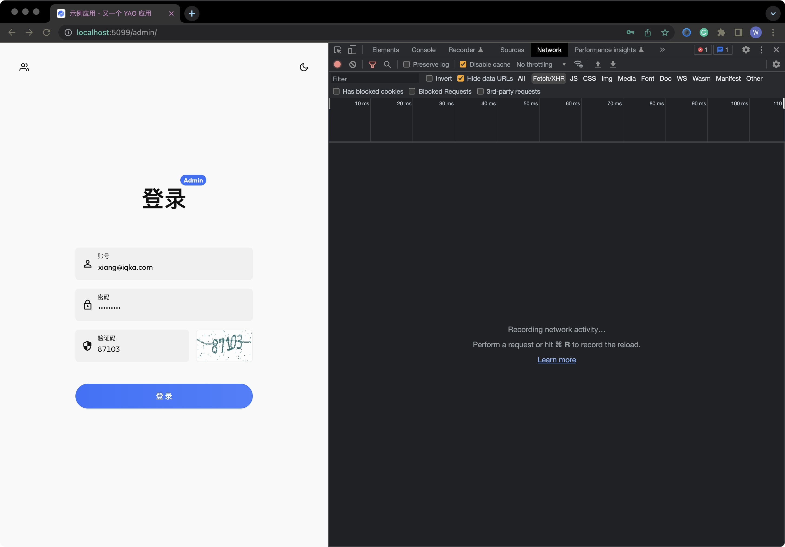
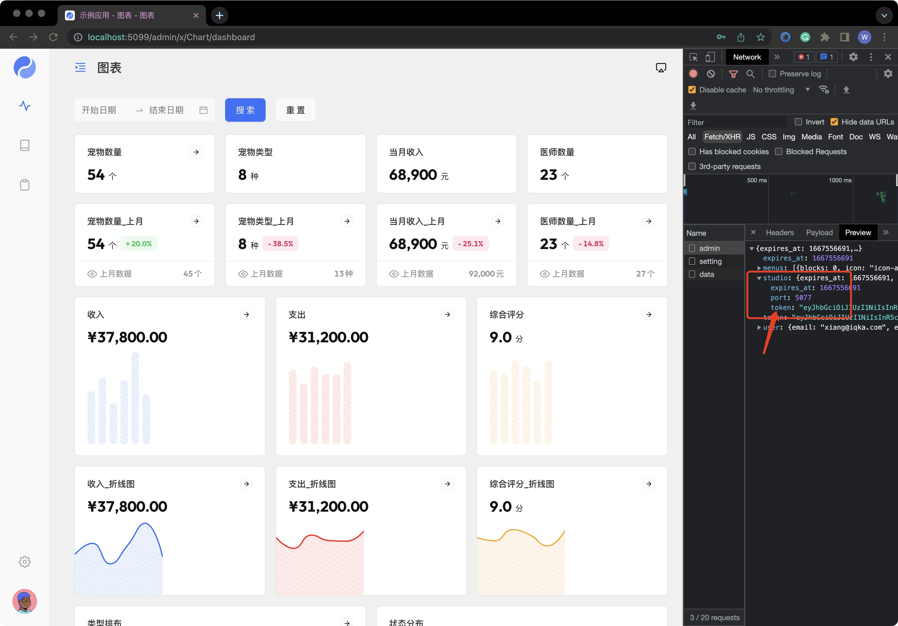

# 使用处理器

<blockquote>
  <p>
    Yao
    提供一组数据原子操作、网络请求、流程控制等一系列的处理器。这些处理器可以在命令行、Widget、Script、云函数和Studio
    中使用。
  </p>
  <p>
    处理器支持自定义，可以通过编写 Flow、Script、 GRPC 插件或自定义 Widget
    方式扩展。
  </p>
</blockquote>

1. 示例中约定应用根目录为 `/data/app`, 实际编写时需替换为应用根目录。
2. 示例中约定服务器地址为 `http://127.0.0.1:5099`, 实际编写时需自行替换。
3. 示例中约定 Studio 服务器地址为 `http://127.0.0.1:5077`, 实际编写时需自行替换。
4. 使用 `<>` 标识自行替换的内容。 例如: `icon-<图标名称>`, 实际编写时应替换为: `icon-foo`, `icon-bar` ...

## 处理器

处理器是完成特定功能的函数 `Process( ...args:any[] ) any`, 由处理器名称、参数表和返回值构成。

处理器包含以下类型：

| 处理器                | 说明                                                        |
| --------------------- | ----------------------------------------------------------- |
| models.<ID\>.\*       | 数据模型原子操作 [查看文档](../手册/处理器/Model)           |
| schemas.<ID\>.\*      | 数据表结构处理器 [查看文档](../手册/处理器/Schema)          |
| stores.<ID\>.\*       | 数据存储处理器 [查看文档](../手册/处理器/Store)             |
| session.\*            | 会话数据 [查看文档](../手册/处理器/Session)                 |
| fs.\*                 | 文件系统 [查看文档](../手册/处理器/Network)                 |
| http.\*               | HTTP 请求 [查看文档](../手册/处理器/Session)                |
| encoding.<METHOD\>.\* | 编码 [查看文档](../手册/处理器/Encoding)                    |
| tasks.<ID\>.\*        | 异步任务 [查看文档](../手册/处理器/Task)                    |
| schedules.<ID\>.\*    | 计划任务 [查看文档](../手册/处理器/Schedule)                |
| yao.component.\*      | 组件 Compute 处理器 (../手册/处理器/Compute)                |
| yao.crypto.\*         | 加密 [查看文档](../手册/处理器/Crypto)                      |
| yao.app.\*            | App Widget 处理器 [查看文档](../手册/处理器/App)            |
| yao.login.\*          | Login Widget 处理器 [查看文档](../手册/处理器/Login)        |
| yao.table.\*          | Table Widget 处理器 [查看文档](../手册/处理器/Table)        |
| yao.form.\*           | Form Widget 处理器 [查看文档](../手册/处理器/Form)          |
| yao.chart.\*          | Chart Widget 处理器 [查看文档](../手册/处理器/Chart)        |
| yao.import.\*         | Import Widget 处理器 [查看文档](../手册/处理器/Chart)       |
| yao.utils.\*          | 一组实用程序 [查看文档](../手册/处理器/Utils)               |
| flows.<ID\>           | 使用 Flow 编写的处理器 [查看文档](逻辑编排)                 |
| scripts.<ID\>.\*      | 使用 Script 脚本编写的处理器 [查看文档](逻辑编排)           |
| plugins.<ID\>.\*      | 使用 GRPC 插件编写处理器 [查看文档](../进阶/编写插件)       |
| widgets.<NAME\>.\*    | 自定义 Widget 导出的的处理器 [查看文档](../专家/编写Widget) |

[查看处理器手册](../手册/处理器/Index)

## 使用方式

### 在命令行中使用

可以使用 `run` 命令，运行处理器 `yao run <process> [args...]`。

```bash
yao run models.product.Paginate '::{}' 1 2
```

### 在 DSL 中使用

可在 YAO DSL (API, Flow, Table, Chart 等) 中使用处理器, 可参考对应 Widget 手册。

[查看 Widget 手册](../手册/Widgets/Index)

**在 API DSL 中使用**

```jsonc
{
  // ...
  "paths": [
    {
      "path": "/search",
      "method": "GET",
      "process": "models.product.Paginate",
      "in": [":query-param", "$query.page", "$quey.pagesize"], // 参数表
      "out": { "status": 200, "type": "application/json" }
    }
  ]
  // ...
}
```

**在 Flow DSL 中使用**

```jsonc
{
  // ...
  "nodes": [
    {
      "name": "宠物",
      "process": "models.product.Find",
      "args": [1, { "select": ["id", "name"] }]
    },
    {
      "name": "打印",
      "process": "yao.utils.Print",
      "args": ["{{$res.宠物}}"]
    }
  ]
  // ...
}
```

**在 Table DSL 中使用**

```jsonc
{
  // ...
  "action": {
    "bind": { "table": "product" },
    "search": {
      "guard": "-",
      "process": "scripts.product.Search",
      "default": [null, 1, 2]
    },
    "save": {
      "guard": "bearer-jwt,scripts.product.Guard"
    },
    "after:search": "scripts.hook.BeforeSearch",
    "after:search": "scripts.hook.AfterSearch"
  }
  // ...
}
```

### 在脚本中使用

可以在 Script, 云函数, Stuido JavaScript 脚本中，使用 `Process(name, ...args)` 函数，调用处理器

**在 Script 中使用**

`/data/app/scripts/demo.js`

```javascript
function GetProduct(id) {
  return Process("models.product.Find", id, { select: ["id", "name"] });
}
```

运行调试

```bash
yao run scripts.demo.GetProduct 1
```

**在云函数中使用**

`/data/app/services/demo.js`

```javascript
function GetProduct(id) {
  return Process("models.product.Find", id, { select: ["id", "name"] });
}
```

运行调试

```bash
yao run yao.utils.JwtMake 1 '::{"id":1, "name":"Admin"}' '::{"issuer":"yao"}'
```

```bash
curl -X POST http://127.0.0.1:5099/api/__yao/app/service/demo \
   -H 'Content-Type: application/json' \
   -H 'Authorization: Bearer <JWT>' \
   -d '{ "method":"GetProduct", "args":[1]}'
```

**在 Studio 中使用**

`/data/app/studio/demo.js`

```javascript
function GetProduct(id) {
  return Process("models.product.Find", id, { select: ["id", "name"] });
}
```

运行调试

```bash
yao studio run demo.GetProduct 1
```

获取 Studio Token





```bash
# Studio JWT 可以通过管理后台, 管理员登录接口获取
curl -X POST http://127.0.0.1:5077/service/demo \
   -H 'Content-Type: application/json' \
   -H 'Authorization: Bearer <Studio JWT>' \
   -d '{ "method":"GetProduct", "args":[1]}'

```

<Div style={{ display: "flex", justifyContent: "space-between" }}>
  <Link type="prev" title="编写图表" link="基础/编写图表"></Link>
  <Link type="next" title="使用Widgets" link="基础/使用Widgets"></Link>
</Div>
