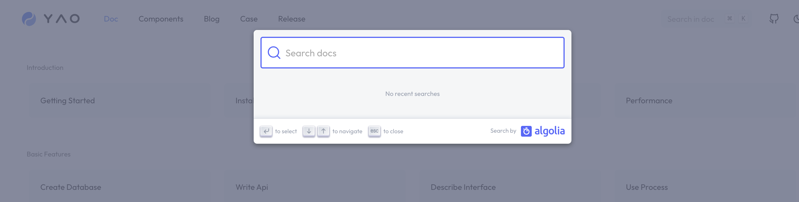
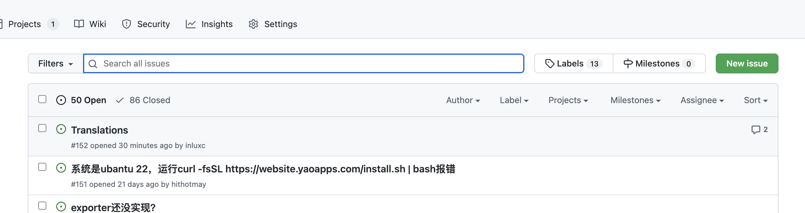
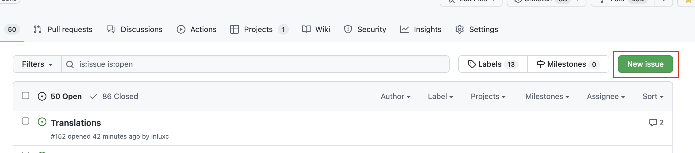

# 如何寻求帮助

如果您在使用中遇到问题，建议按照以下顺序寻求帮助:

1. 文档搜索
2. 在 Issues 搜索
3. 在 Issues 提问
4. 开发者微信交流群

## 文档搜索

进入官方文档页面，点击搜索框，输入问题关键词，按回车键

## 在 Issues 搜索

进入 YAO 项目仓库 Issues, 在搜索框输入问题关键词，按回车键

## 在 Issues 提问

进入 YAO 项目仓库 Issues, 点击 New issue 按钮, 提问

输入问题的主题和内容。

为了更好可以更快得到回复，建议在问题描述里说明:

1. YAO 版本号 (使用 yao version 命令查询)
2. 应用报错信息
3. 应用错误日志 ( 默认日志文件 logs/application.log )

## 开发者微信群

加入开发者微信群, 在微信群内提问。

[微信群](...)
