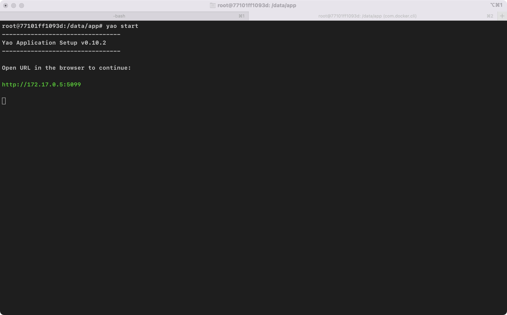
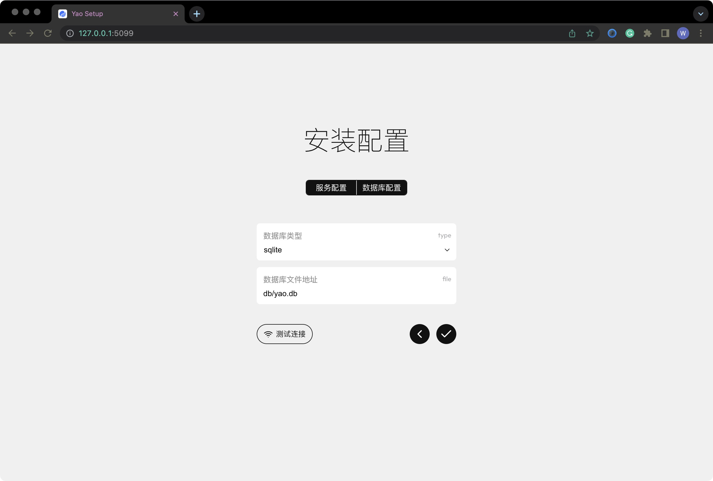

# 安装配置

<blockquote>
  服务启动时，如果未检测到应用配置信息,将启动应用安装服务，根据提示完成安装配置。
</blockquote>

**约定**

1. 示例中约定应用根目录为 `/data/app`, 实际编写时需替换为应用根目录。
2. 使用 `<>` 标识自行替换的内容。 例如: `icon-<图标名称>`, 实际编写时应替换为: `icon-foo`, `icon-bar` ...

## 第一步: 创建应用目录

创建一个空的应用目录, 进入应用目录，运行 `yao start` 命令

```bash
mkdir -p /data/app
cd /data/app
yao start
```



## 第二步: 安装配置

根据命令行提示，使用浏览器打开安装页面 `http://<IP>:<PORT>/`, 根据页面提示完成安装配置。

<Notice type="warning">
  如果网络结构较为复杂，命令行提示的IP地址无法访问，可根据实际网络结构，更换为相应IP地址。
</Notice>

服务配置


数据库配置



安装程序会自动创建演示代码, 安装完毕后，应用目录代码结构：


## 登录管理后台

配置完成后，自动转向管理员登录页面。

<Notice type="warning">
  管理后台默认用户名: `xiang@iqka.com`， 密码: `A123456p+`
</Notice>


示例界面


<Div style={{ display: "flex", justifyContent: "space-between" }}>
  <Link type="prev" title="YAO命令" link="基础/YAO命令"></Link>
  <Link type="next" title="创建数据模型" link="基础/创建数据模型"></Link>
</Div>
