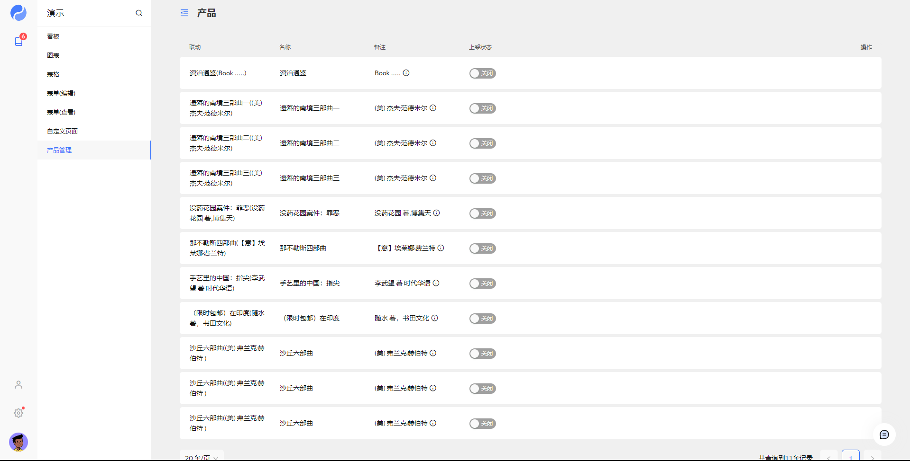

# 编写界面

<blockquote>
  YAO 内建 XGen 界面引擎，封装了 Table, Form, Chart 等一系列常用功能，通过编写
  DSL 实现多种功能模块。
</blockquote>

**约定**

1. 示例中约定应用根目录为 `/data/app`, 实际编写时需替换为应用根目录。
2. 使用 `<>` 标识自行替换的内容。 例如: `icon-<图标名称>`, 实际编写时应替换为: `icon-foo`, `icon-bar` ...

## 编写表格

### 添加表格 DSL 文件

在 `tables` 目录下, 创建一个 Table DSL 文件, 与一个 `product` 数据模型绑定。

在浏览器输入表格路由地址访问:

`http://<IP>:<YAO_PORT>/<管理后台路由前缀>/x/Table/product`

`/data/app/tables/product.tab.yao`

```json
{
  "name": "产品",
  "action": {
    "bind": { "model": "product" }
  }
}
```

### 修改表格布局

修改 Table DSL, 刷新页面预览效果。 (如未开启 `watch` 需手动重启服务)

`/data/app/tables/product.tab.yao`

```json
{
  "name": "产品",
  "action": { "bind": { "model": "product" } },
  "layout": {
    "header": { "preset": {} },
    "table": {
      "columns": [
        { "name": "名称", "width": 200 },
        { "name": "上架状态", "width": 200 }
      ]
    }
  }
}
```

### 修改呈现组件

修改 Table DSL, 刷新页面预览效果。 (如未开启 `watch` 需手动重启服务)

`/data/app/tables/product.tab.yao`

```json
{
  "name": "产品",
  "action": { "bind": { "model": "product" } },
  "layout": {
    "header": { "preset": {} },
    "table": {
      "columns": [
        { "name": "联动", "width": 200 },
        { "name": "名称", "width": 200 },
        { "name": "备注", "width": 200 },
        { "name": "上架状态", "width": 200 }
      ]
    }
  },
  "fields": {
    "table": {
      "联动": {
        "bind": "online",
        "view": {
          "bind": "new_field",
          "type": "Text",
          "compute": {
            "process": "Concat",
            "args": ["$C(row.name)", "(", "$C(row.remark)", ")"]
          }
        },
        "edit": {
          "type": "Select",
          "props": {
            "options": [
              { "label": "已上架", "value": true },
              { "label": "已下架", "value": false }
            ]
          }
        }
      }
    }
  }
}
```

[查看 Table Widget 手册](../手册/Widgets/Table)

## 编写表单

### 添加表单 DSL 文件

在 `forms` 目录下, 创建一个 Form DSL 文件, 与 `product` 数据模型绑定。

在浏览器输入表格路由地址访问:

`http://<IP>:<YAO_PORT>/<管理后台路由前缀>/x/Form/product/0/edit`

`/data/app/forms/product.form.yao`

```json
{
  "name": "产品",
  "action": { "bind": { "model": "product" } }
}
```

[查看 Form Widget 手册](../手册/Widgets/Form)

## 表格关联表单

修改 Table DSL 文件，新增添加按钮、行编辑按钮。刷新页面预览效果。(如未开启 `watch` 需手动重启服务)

`/data/app/tables/product.tab.yao`

```json
{
  "name": "产品",
  "action": { "bind": { "model": "product" } },
  "layout": {
    "header": { "preset": {} },
    "filter": {
      "columns": [{ "name": "名称", "width": 4 }],
      "actions": [
        {
          "title": "添加产品",
          "icon": "icon-plus",
          "width": 3,
          "action": {
            "Common.openModal": {
              "Form": { "type": "edit", "model": "product" }
            }
          }
        }
      ]
    },
    "table": {
      "columns": [
        { "name": "联动", "width": 200 },
        { "name": "名称", "width": 200 },
        { "name": "备注", "width": 200 },
        { "name": "上架状态", "width": 200 }
      ],
      "operation": {
        "fold": false,
        "width": 255,
        "actions": [
          {
            "title": "查看",
            "icon": "icon-eye",
            "action": {
              "Common.openModal": {
                "Form": { "type": "view", "model": "product" }
              }
            }
          },
          {
            "title": "编辑",
            "icon": "icon-edit-2",
            "action": {
              "Common.openModal": {
                "Form": { "type": "edit", "model": "product" }
              }
            }
          }
        ]
      }
    }
  },
  "fields": {
    "table": {
      "联动": {
        "bind": "online",
        "view": {
          "bind": "new_field",
          "type": "Text",
          "compute": {
            "process": "Concat",
            "args": ["$C(row.name)", "(", "$C(row.remark)", ")"]
          }
        },
        "edit": {
          "type": "Select",
          "props": {
            "options": [
              { "label": "已上架", "value": true },
              { "label": "已下架", "value": false }
            ]
          }
        }
      }
    }
  }
}
```

## 添加菜单

编辑 `/data/app/flows/app/menu.flow.yao` 添加菜单项

<Detail title="查看源码">

```json
{
  "name": "APP Menu",
  "nodes": [],
  "output": {
    "setting": [
      {
        "blocks": 0,
        "icon": "icon-user",
        "name": "管理员",
        "path": "/x/Table/admin.user",
        "visible_menu": 0
      },
      {
        "icon": "icon-settings",
        "id": 999999,
        "name": "设置",
        "path": "/x/Form/demo.pet/1/edit",
        "dot": true,
        "children": [
          {
            "name": "设置项演示",
            "badge": 24,
            "path": "/x/Form/demo.pet/1/edit"
          },
          { "name": "系统设置", "path": "/setting" }
        ]
      }
    ],
    "items": [
      {
        "blocks": 0,
        "icon": "icon-book",
        "name": "演示",
        "path": "/x/Dashboard/kanban",
        "visible_menu": 0,
        "badge": 6,
        "children": [
          {
            "blocks": 0,
            "icon": "icon-activity",
            "name": "看板",
            "path": "/x/Dashboard/kanban",
            "visible_menu": 1
          },
          {
            "blocks": 0,
            "icon": "icon-activity",
            "name": "图表",
            "path": "/x/Chart/pet",
            "visible_menu": 1
          },
          {
            "blocks": 0,
            "name": "表格",
            "path": "/x/Table/demo.pet",
            "visible_menu": 1
          },
          {
            "blocks": 0,
            "name": "表单(编辑)",
            "path": "/x/Form/demo.pet/1/edit",
            "visible_menu": 1
          },
          {
            "name": "表单(查看)",
            "path": "/x/Form/demo.pet/1/view",
            "visible_menu": 1
          },
          {
            "name": "自定义页面",
            "path": "/iframe?src=/demo/pet.html",
            "visible_menu": 1
          },
          {
            "blocks": 0,
            "name": "产品管理",
            "path": "/x/Table/product",
            "visible_menu": 1
          }
        ]
      }
    ]
  }
}
```

</Detail>

退出后台重新登录。

<!--  -->

通过菜单访问



<Div style={{ display: "flex", justifyContent: "space-between" }}>
  <Link type="prev" title="编写接口" link="基础/编写接口"></Link>
  <Link type="next" title="编写图表" link="基础/编写图表"></Link>
</Div>
