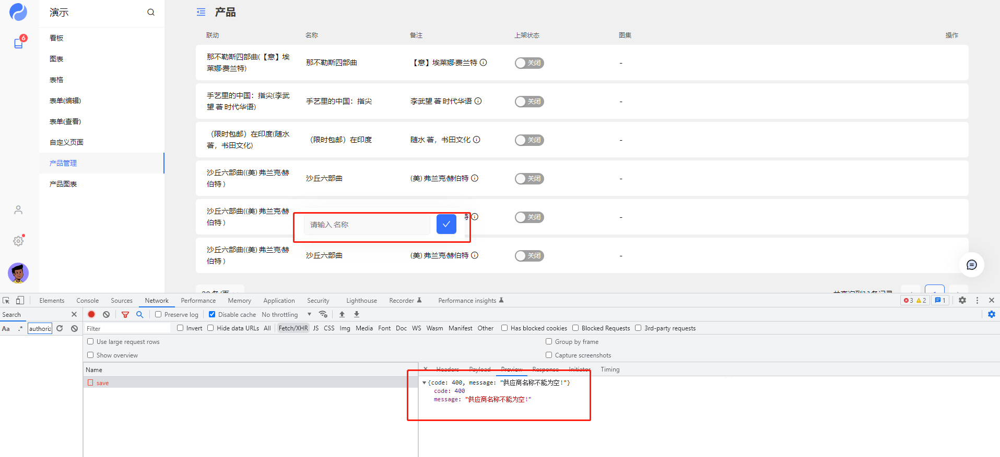

# 接口鉴权

<blockquote>
  接口鉴权支持自定义编写接口鉴权和使用系统自带 <strong>bearer-jwt</strong>
  的鉴权,使用<strong>guard</strong>关键字来指定鉴权的处理器，可以在 <strong>
    http
  </strong>接口中使用，也可以在<strong>table</strong>和<strong>form</strong>中使用
</blockquote>

参数列表:

| 参数名称 | 说明          |
| -------- | ------------- |
| path     | 请求的路径    |
| params   | 请求 url 参数 |
| query    | 查询参数      |
| payload  | POST 请求参数 |
| headers  | 请求头部      |

## 在自定义的 HTTP 接口中使用

首先我们自定义一个鉴权的方法`/scripts/guard.js`

```javascript
/**
 * 字段验证guard
 * @param {*} path
 * @param {*} params
 * @param {*} query
 * @param {*} payload
 * @param {*} headers
 * @returns
 */
function Validate(path, params, query, payload, headers) {
  console.log([path, params, query, payload, headers]);
  if (!payload.name) {
    throw new Exception("名称不能为空!", 400);
  }

  var exists = Process("models.product.get", {
    wheres: [{ column: "name", value: payload.name }],
  });
  if (exists && exists.length > 0) {
    throw new Exception("名称已经存在", 400);
  }

  return;
}
```

在 `/apis/product.http.yao`增加一条路由,使用 curl 的时候会提示 `{"code":400,"message":"名称不能为空!"}`

```json
{
  "path": "/validate",
  "guard": "scripts.guard.Validate",
  "method": "POST",
  "process": "models.product.Save",
  "in": [":payload"],
  "out": { "status": 200, "type": "application/json" }
}
```

```bash
curl --location --request POST 'http://127.0.0.1:5099/api/product/validate'
```

## 在 TABLE 和 FORM 使用

在 `/tables/product.tab.yao`和 `/forms/product.form.yao`中加入:

```json
  "action": {
    "bind": { "model": "product" },
    "save": {
      "guard": "scripts.guard.Validate"
    }
  }

```

修改列表的名称字段为空,然后点击提交:


<Div style={{ display: "flex", justifyContent: "space-between" }}>
  <Link type="prev" title="复杂数据查询" link="进阶/复杂数据查询"></Link>
  <Link type="next" title="数据导入" link="进阶/数据导入"></Link>
</Div>
